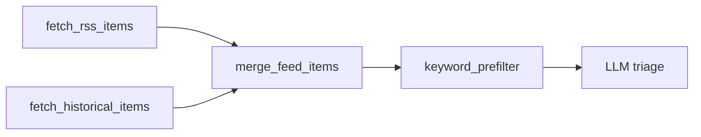

# Plan: GitHub issue #101 — Semantic Scholar API (`runner-module`)

## Repo and branch

- **Primary implementation:** [palol/tocify](https://github.com/palol/tocify), branch **`runner-module`** (tracks `origin/runner-module`).
- **Paths below** are relative to the **tocify repo root**.

Downstream consumers (e.g. **neural-noise**) only need a version/git pin bump after tocify merges; they are not where issue #101 is implemented.

## Problem (issue summary)

RSS + OpenAlex can **miss thesis / institutional** and other S2-heavy coverage. Semantic Scholar’s **`/graph/v1/paper/search`** returns structured JSON with query + **publicationDateOrYear**-style filtering.

Example:

`GET https://api.semanticscholar.org/graph/v1/paper/search?query=...&fields=title,year,authors,externalIds&publicationDateOrYear=2026-01-01:2026-01-07`

## Code map (verified on `runner-module`)

| Role | File |
|------|------|
| Historical backends (OpenAlex, NewsAPI, …) | `tocify/historical.py` — `fetch_historical_items()`, loop over `backends` |
| Weekly orchestration: build `backends`, call `fetch_historical_items`, `merge_feed_items` | `tocify/runner/weekly.py` — `run_weekly()` ~lines 1383–1438 |
| Pattern for env-based HTTP backend + standard item schema | `tocify/news.py` |
| Test style (mock HTTP, assert schema / dates) | `tests/test_googlenews.py` |

Shared item fields (unchanged): `id`, `source`, `title`, `link`, `published_utc`, `summary`.

## Checklist

- [ ] Add `tocify/semanticscholar.py` with `fetch_semantic_scholar_items()` (S2 JSON -> standard item dicts; normalized query, date window, pagination, optional `x-api-key`).
- [ ] Extend `tocify/historical.py` `fetch_historical_items()` with backend `semanticscholar` and an explicit `semanticscholar_query` kwarg plus env limits (`SEMANTIC_SCHOLAR_*`).
- [ ] In `tocify/runner/weekly.py` (~1383–1435): `WEEKLY_SEMANTIC_SCHOLAR` gate; pass `week_start` / `week_end` + explicit Semantic Scholar query into `fetch_historical_items`.
- [ ] Add `tests/test_semanticscholar.py` (mirror `tests/test_googlenews.py`: mocked requests, schema + mandatory backend-side date window filtering).
- [ ] Add a runner-level weekly wiring test proving `WEEKLY_SEMANTIC_SCHOLAR` appends the backend and forwards query/date args to `fetch_historical_items()`.
- [ ] Document `WEEKLY_SEMANTIC_SCHOLAR` and `SEMANTIC_SCHOLAR_*` in `README.md`.
- [ ] Bump tocify `pyproject.toml` version for release / pin.
- [ ] **Downstream (neural-noise):** bump tocify git ref, optional `content/readme.md` colophon, optional `weekly_brief.yml` env + API secret.

## Implementation steps (all in tocify)

### 1. `tocify/semanticscholar.py`

- `fetch_semantic_scholar_items(start_date, end_date, *, query: str | None, ...)` using `requests.get("https://api.semanticscholar.org/graph/v1/paper/search", ...)`.
- Query params: `query`, `fields` (e.g. `title`, `year`, `authors`, `publicationDate`, `url`, `externalIds`, `abstract`), `publicationDateOrYear={start_date}:{end_date}`, and offset/limit pagination per [S2 API docs](https://api.semanticscholar.org/api-docs/).
- **Query normalization:** normalize the S2 query before sending it (replace hyphens with spaces, collapse whitespace, trim/cap length). Do not assume the OpenAlex query string is S2-safe.
- **Date filtering:** still apply a mandatory backend-side `start_date`-`end_date` filter on parsed `publicationDate` / `year` before returning. `runner/weekly.py` only re-applies the exact week window when `week_spec` is set, so the backend itself must enforce the window for normal weekly runs too.
- **`link`:** prefer `https://doi.org/{doi}` from `externalIds`; else S2 `url`.
- **`id`:** `sha1(f"Semantic Scholar|{title}|{link}")` (same pattern as other backends).
- **Env:** e.g. `SEMANTIC_SCHOLAR_API_KEY` / `S2_API_KEY` → header `x-api-key`; `SEMANTIC_SCHOLAR_TIMEOUT`, `SEMANTIC_SCHOLAR_MAX_ITEMS`, optional page size; on HTTP errors / empty body, warn and return `[]` like `news.py` when unconfigured.

### 2. `tocify/historical.py`

- Add `elif name == "semanticscholar":` importing `fetch_semantic_scholar_items` with an explicit `semanticscholar_query` kwarg (fallback to `openalex_search` only if omitted for backward compatibility).
- Update module/docstring list of backend names.

### 3. `tocify/runner/weekly.py`

- `WEEKLY_SEMANTIC_SCHOLAR` via `env_bool` (choose default explicitly: **off** avoids surprise 429s without a key; **on** matches `WEEKLY_OPENALEX` aggressiveness—document in commit).
- If enabled and `topic_search` non-empty: `backends.append("semanticscholar")` and pass the explicit normalized Semantic Scholar query into `fetch_historical_items(...)`.

### 4. Tests

- `tests/test_semanticscholar.py` — mock `requests.get`, assert normalized items, query normalization, and that dates outside `start_date`-`end_date` are dropped before return.
- Add a `run_weekly()`-level unit test using `tests/runner_test_utils.py` to verify `WEEKLY_SEMANTIC_SCHOLAR=1` appends the backend and forwards `week_start`, `week_end`, and `semanticscholar_query` to `fetch_historical_items(...)`.

### 5. Version

- Bump `pyproject.toml` / package version in tocify for a releasable tag or neural-noise pin.

## Downstream (neural-noise) — after tocify ships

- Bump tocify git ref in `pyproject.toml`, `uv lock`.
- Optional: `content/readme.md` colophon; `WEEKLY_SEMANTIC_SCHOLAR` + secret in `.github/workflows/weekly_brief.yml`.

## Non-goals

- DOI-level dedupe across OpenAlex vs S2 (same work, different URLs).
- Replacing OpenAlex; S2 is **additive**.

## Risks

- **Rate limits / 429** without API key; graceful empty return + warning.
- **Relevance search cap:** `/graph/v1/paper/search` only returns the first 1,000 relevance-ranked results; acceptable for narrow weekly topic queries, but document as a ceiling.
- **Duplicate narratives** in triage if both OpenAlex and S2 return the same paper under different links.

## Implementation hygiene

When implementing, use the **checkpoint worktree** workflow on **tocify** (`runner-module`) separately from any neural-noise bump.
